# 基础知识

## 环境搭建

- 使用 keil 新建工程，选择 cortex-m3

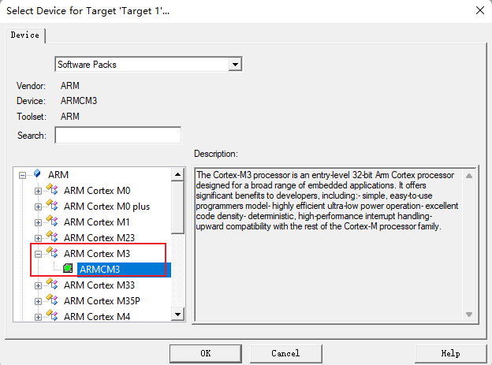

- 选择运行环境：

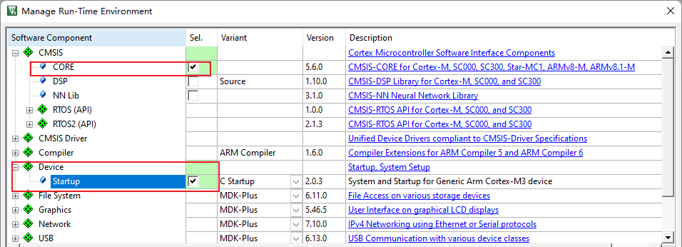

“unrecognized GCC pragma” 告警消除：

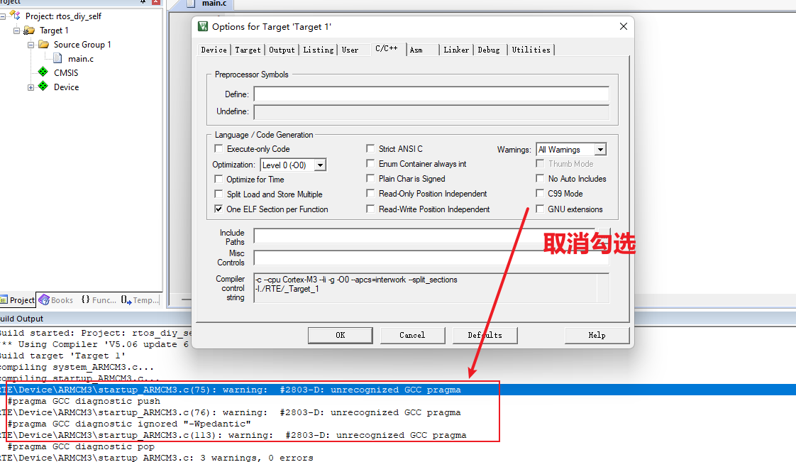

”ARM_LIB_STACK” 告警消除：


## 芯片内核简介

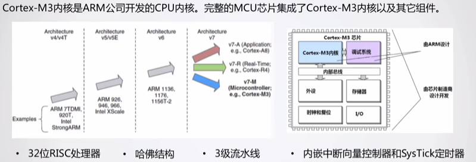

## 异常与中断处理

rtos 内核主要关心三个异常：

- Reset、PendSV、Systick

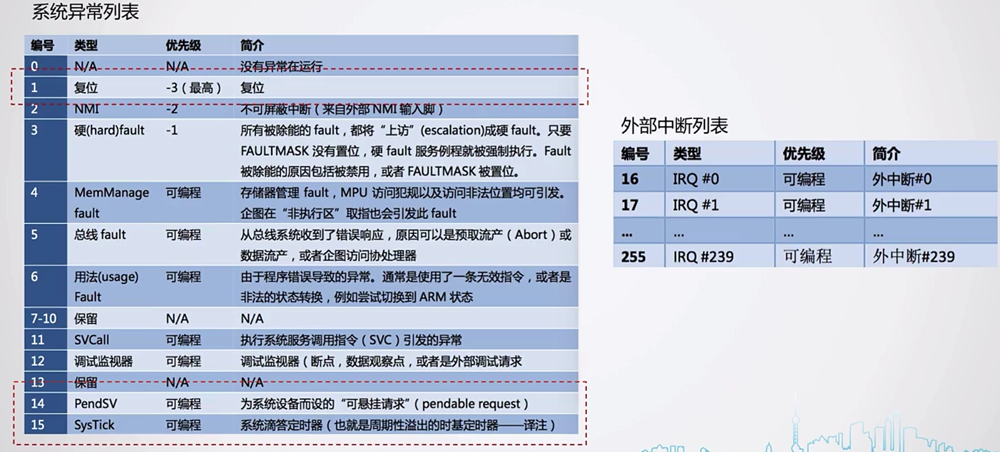

当异常发生的时候，**<span style="color:#3333FF;"> 硬件会自动 </span> 做的一些操作**：

- 步骤 1：将 xPSR、PC、LR、R12、R0~R3 自动进行压栈。
  - 硬件只压了一部分，剩余的需要用户自行进行保存。
- 步骤 2：从对应的中断向量表取出入口地址。
  - 2.1 自动将其 <span style="color:#3333FF;"> **赋值到 PC 寄存器** </span> 当中。
  - 2.2 更新 SP 堆栈指针与 LR 寄存器。（LR 寄存器已经不再存放进入中断前的地址，因为之前 **已经被自动压栈**，将其放在了栈空间当中）

- 步骤 3：执行中断处理函数

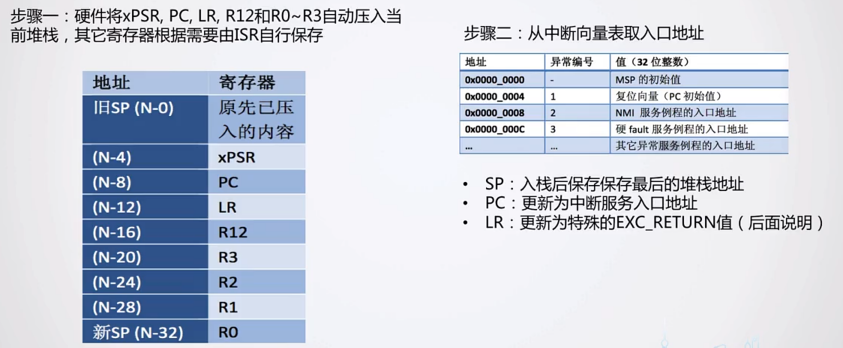

退出异常：

- 步骤 1：执行返回指令，可以是 Bx lr，也可以是其他指令。
- 步骤 2：恢复先前入栈的寄存器。
- 步骤 3：从原中断发生的地方继续运行。
- 注意：在返回的时候，会根据 EXC_RETURN 的值来执行对应的返回动作。


### 复位异常

芯片在复位的时候，会默认进入复位异常，通常有以下步骤：

- 将 0x0000 0000 地址的 异常函数地址，赋值给 PC 指针。
- 将 0x0000 0004 地址的 栈地址，赋值为 SP 指针。

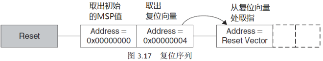

通过软件仿真：

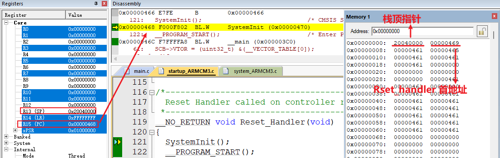

### PendSV 异常

为什么需要引入 pendsv 异常？现在假如让我来实现一个小的调度器：

> - 我想用 Systick 来实现，在 Systick 对任务进行轮询调度。
> - 存在的问题：
>   - Systick 优先级最高时候，整个任务的调度运行耗时太长就会导致其余 ISR 中断实时性降低。
>   - Systick 优先级最低的时候，又会导致系统的时钟不准确。
>   - Cortex 权威指南当中，将 **Systick 的中断优先级设置为了最高**，因为他认为时间基准要比其他的 IRQ 中断重要。

Systick 的中断优先级设置为了最高，并且任务切换在 Systick 当中运行的时候，就有可能发生以下情况：

- 任务 A 正在运行，IRQ 打断，然后来了一个 Systick 中断。
- Systick 打断 IRQ，并且进行了上下文切换（直接把栈空间切换了，所以会直接运行任务 B）。
- 再来一个 Systick ，再进行上下文切换的时候，才能切换到 任务 A 与 IRQ 的栈空间。


引入 PendSV ，中断事件的流水账记录如下：

1. 任务 A 呼叫 SVC 来请求任务切换（例如，等待某些工作完成）。（todo 这部分怎么操作？）
2. OS 接收到请求，做好上下文切换的准备，并且悬起一个 PendSV 异常。
3. 当 CPU 退出 SVC 后，它立即进入 PendSV，从而执行上下文切换。
4. 当 PendSV 执行完毕后，将返回到任务 B，同时进入线程模式。
5. 发生了一个中断，并且中断服务程序开始执行
6. 在 ISR 执行过程中，发生 SysTick 异常，并且抢占了该 ISR。
7. OS 执行必要的操作，然后悬起 PendSV 异常以作好上下文切换的准备。
8. 当 SysTick 退出后，回到先前被抢占的 ISR 中， ISR 继续执行
9. ISR 执行完毕并退出后， PendSV 服务例程开始执行，并且在里面执行上下文切换
10. 当 PendSV 执行完毕后，回到任务 A，同时系统再次进入线程模式。  

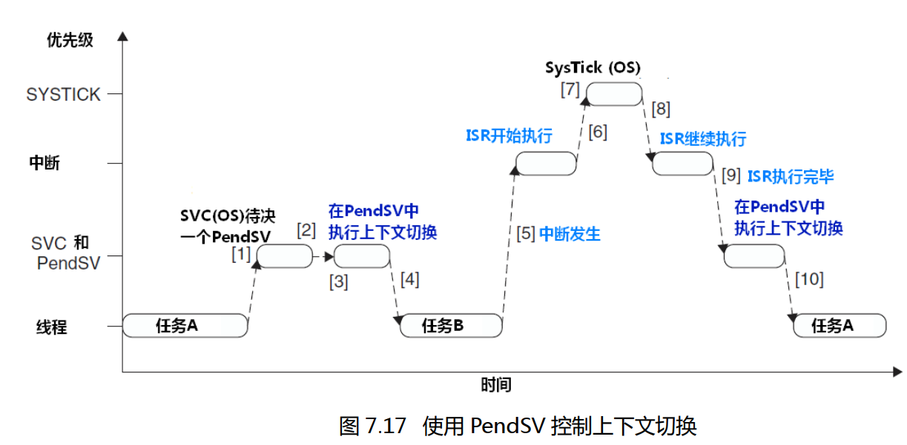

## test01--内核编程

需求如下：

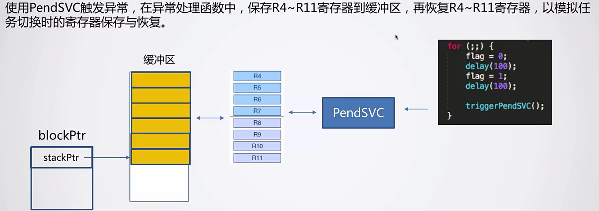

中断控制状态寄存器介绍：

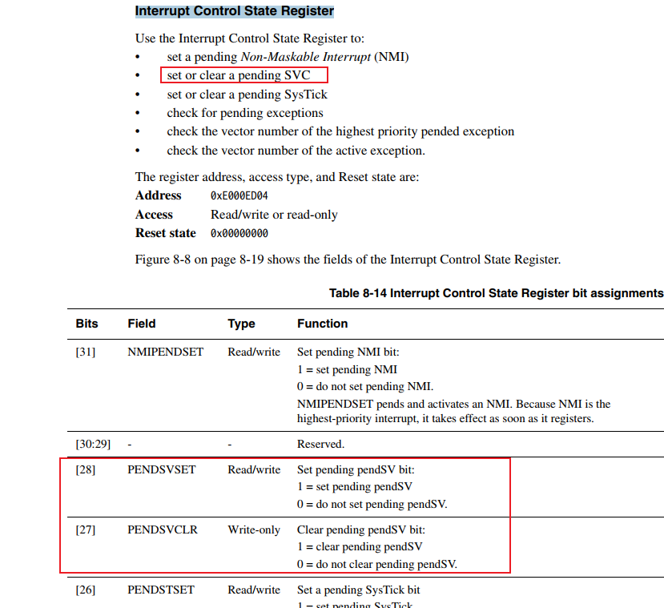

异常优先级设置寄存器：

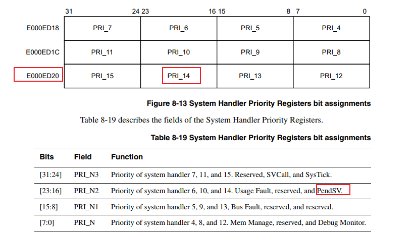

详细编码查看本次提交。

>[TEST] rtos-diy-1.1：内核编程实践：实现在 PendSV 异常当中保存 R4-R11、恢复 R4-R11 demo。

***

# 基本任务切换

## 任务的定义与切换原理

什么是任务？

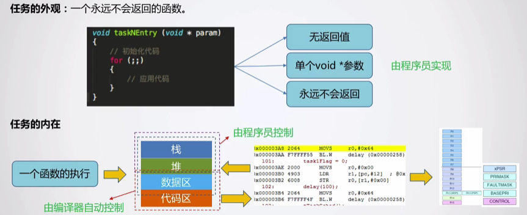

任务切换的原理：

- 任务切换 **<span style="color:#6666FF;"> 可能随时发生 </span>**。
- 任务切换的本质：保存前一个任务运行的状态，恢复后一个任务运行的状态。

任务有哪些需要保存的状态：

- 代码、数据段：由编译器自动分配，我们无序关注。（x）
- 堆：我们自己实现的这个内核 os 不使用。
- 栈：硬件只支持两个堆栈空间（MSP、SP），不同任务不能公用。
- 内核寄存器。

解决办法：

- 为每一个任务都创建一个独立的栈空间。

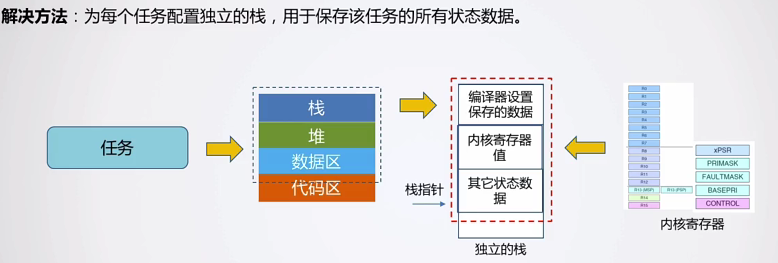

## test02--任务切换demo

两个核心问题：

- 怎么运行第一个任务？
- 怎么在两个任务之间来回切换？

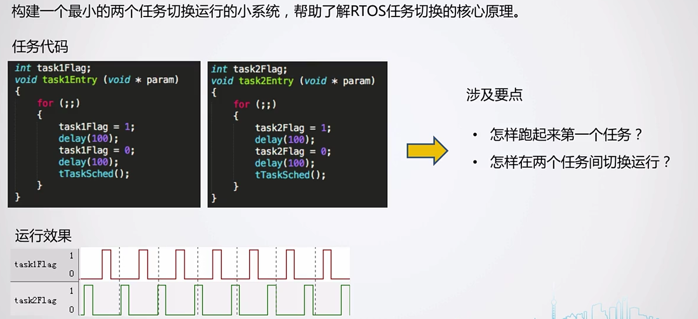

### 怎么运行第一个任务

这个问题其实也不是一个简单的问题，可能 ”运行” 这个字眼让我们觉得比较简单，直接调用以下即可。我们换一个字眼如何 切换第一个任务。

我们将其进行拆解：

- 在哪里进行切换？
  - 第一次任务切换，仍然在 pendsv 中断当中切换，将其当作是一个特殊的一次切换。
- 第一次任务切换，栈空间变化吗？
  - 当然变化，要从系统的栈切换到任务的栈。系统栈 ---> 任务栈。

- 第一次任务切换，硬件如何恢复任务的现场？
  - 第一次任务的现场，需要自己来进行伪造。
  - 提前填充数据到任务栈，然后用其来恢复现场。

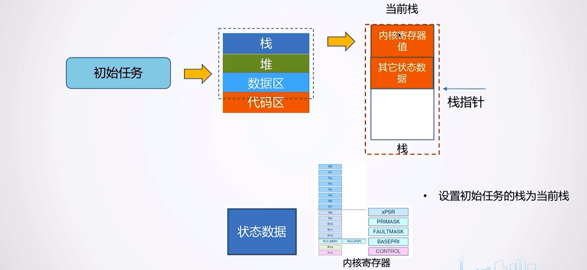

初始栈空间的数据伪造，伪造也是耦合硬件特性的：

- 耦合硬件的自动恢复现场的顺序。
- 耦合 “LDMIA” 指令的恢复顺序

```c

```

在 PendSV 当作切换任务流程：

- PendSV 需要处理两种情况：第一次任务切换，后续的两个任务之间的切换。
- 如何判断是不是第一次任务切换？
  - 答：PSP 指针只有初始化的时候，才会是0。只要进行过一次任务调度，PSP 的值就会发生变化。

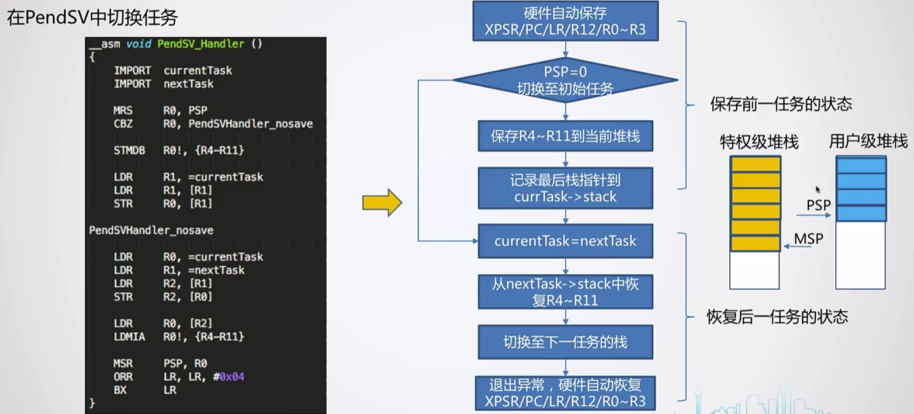

- 系统上电模式使用的特权级的堆栈，即使用的 MSP，我们如何切换到 PSP 呢？
  - 答：LR 进入异常中断当作，他的值就会发生变化。（可以debug运行观测）
  - 我们可以通过设置 bit2 ，来确认其返回之后使用哪一个堆栈。

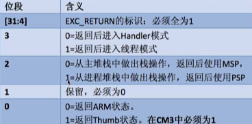


### 两个任务之间切换


### 实践现象分析

#### 栈空间变化分析：

背景：

- task1_stack 的首地址：0x2000 002c，尾地址为：0x2000 102c

1. 任务栈的初始化

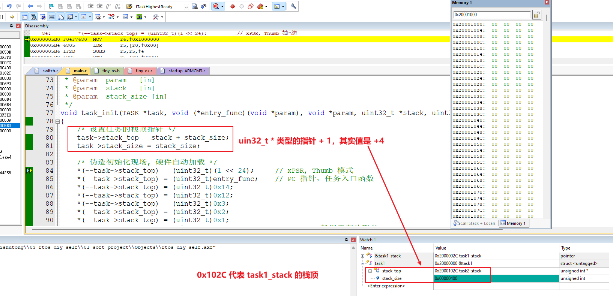

2. 伪造现场

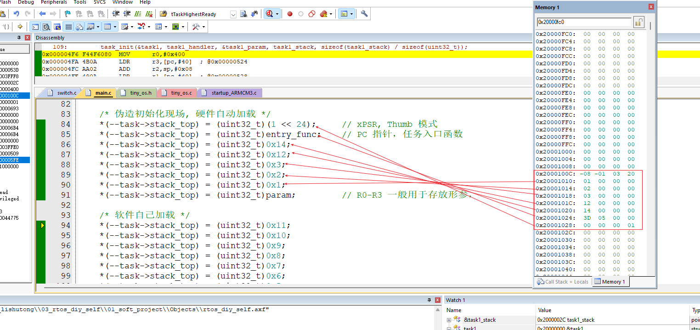

3. 伪造现场完，栈顶指针的值的变化。

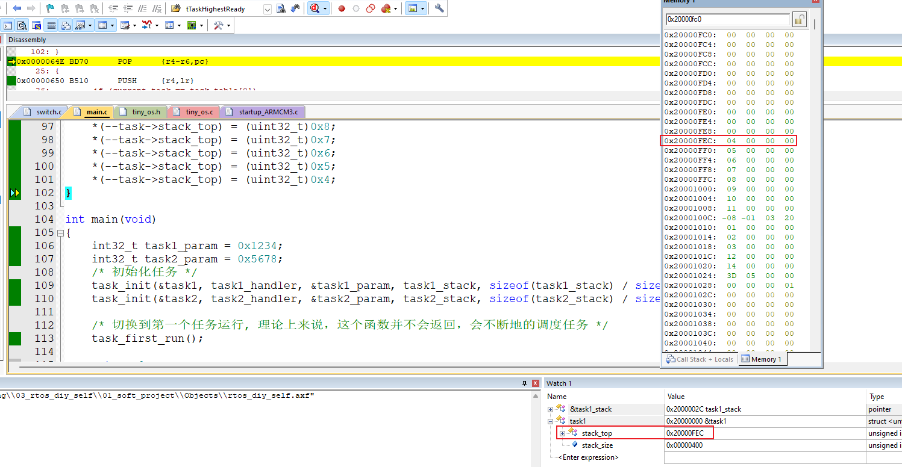

4. 第一次任务调度：

- 软件进行现场恢复：

  - 伪造的现场 ---> 内核寄存器当中。

  - 栈顶指针移动。

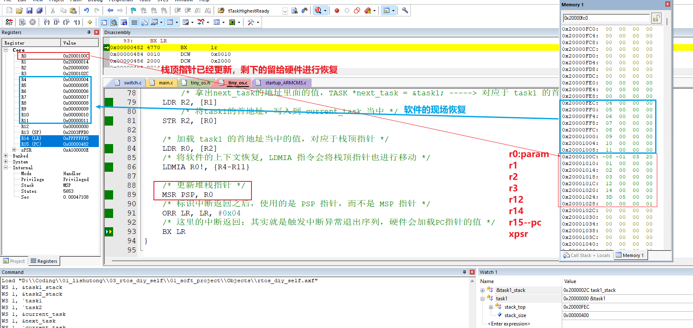

- 硬件的现场恢复：
  - 伪造的现场 ---> 内核寄存器当中。
  - 栈顶指针移动。

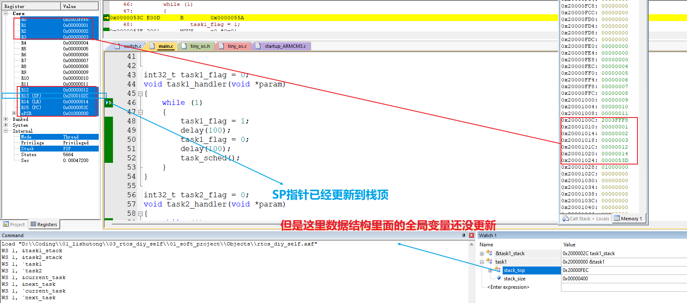


#### 逻辑分析仪

实验现象如下：

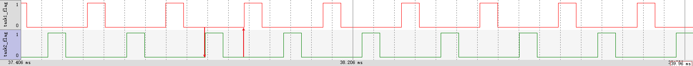


代码如下：

- 我们想实现的效果：task1_flag 高低电平各占 100ms。
- 实际效果：低电平耗时较长一点。（因为把任务2的实践也算进去了）

```c
void task1_handler(void *param)
{
	while (1)
	{
		task1_flag = 1;
		delay(100);
		task1_flag = 0;
		delay(100);
		task_sched();
	}
}
```


### todo

之前demo的缺点：

- 任务的数据结构里面的栈顶指针没有及时更新。
- 每个任务必须主动调用 tTaskSched()，来切换至下一个任务运行。如果他们不进行主动切换，则会一直占用 CPU。
  - 有没有办法，自动管理任务之间的调度呢？避免 CPU 一直被某一个任务占用。


****

## test03--时间片调度

涉及要点：

- systick 初始化配置
- 在 SysTick_Handler 当中调用任务调度函数。


两个任务代码的改进：

- 不在需要手动的调用任务切换函数。

```c
int32_t task1_flag = 0;
void task1_handler(void *param)
{
	systick_init(10);
	while (1)
	{
		task1_flag = 1;
		delay(100);
		task1_flag = 0;
		delay(100);
	}
}

int32_t task2_flag = 0;
void task2_handler(void *param)
{
	while (1)
	{
		task2_flag = 1;
		delay(100);
		task2_flag = 0;
		delay(100);
	}
}
```

实验现象：

- 基于时间片在运行

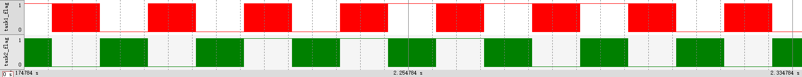

todo:

- delay 函数在浪费 CPU 的性能。

