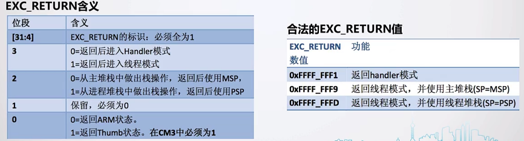

# 基础知识

## 环境搭建

- 使用 keil 新建工程，选择 cortex-m3

- 选择运行环境：

“unrecognized GCC pragma” 告警消除：

”ARM_LIB_STACK” 告警消除：

## 芯片内核简介

## 异常与中断处理

rtos 内核主要关心三个异常：

- Reset、PendSV、Systick

当异常发生的时候，**硬件会自动做的一些操作**：

- 步骤1：将 xPSR、PC、LR、R12、R0~R3 自动进行压栈。
  - 硬件只压了一部分，剩余的需要用户自行进行保存。
- 步骤2：从对应的中断向量表取出入口地址。
  - 2.1 自动将其**赋值到 PC 寄存器**当中。
  - 2.2 更新 SP 堆栈指针与 LR 寄存器。（LR 寄存器已经不再存放进入中断前的地址，因为之前**已经被自动压栈**，将其放在了栈空间当中）

- 步骤3：执行中断处理函数

退出异常：

- 步骤1：执行返回指令，可以是 Bx lr，也可以是其他指令。
- 步骤2：恢复先前入栈的寄存器。
- 步骤3：从原中断发生的地方继续运行。
- 注意：在返回的时候，会根据 EXC_RETURN 的值来执行对应的返回动作。

### 复位异常

芯片在复位的时候，会默认进入复位异常，通常有以下步骤：

- 将 0x0000 0000 地址的 异常函数地址，赋值给 PC 指针。
- 将 0x0000 0004 地址的 栈地址，赋值为 SP 指针。

通过软件仿真：

### PendSV 异常

为什么需要引入 pendsv 异常？现在假如让我来实现一个小的调度器：

> - 我想用 Systick 来实现，在 Systick 对任务进行轮询调度。
> - 存在的问题：
>   - Systick 优先级最高时候，整个任务的调度运行耗时太长就会导致其余 ISR 中断实时性降低。
>   - Systick 优先级最低的时候，又会导致系统的时钟不准确。
>   - Cortex 权威指南当中，将 **Systick 的中断优先级设置为了最高**，因为他认为时间基准要比其他的 IRQ 中断重要。

Systick 的中断优先级设置为了最高，并且任务切换在 Systick 当中运行的时候，就有可能发生以下情况：

- 任务 A 正在运行，IRQ 打断，然后来了一个 Systick 中断。
- Systick 打断 IRQ，并且进行了上下文切换（直接把栈空间切换了，所以会直接运行任务B）。
- 再来一个 Systick ，再进行上下文切换的时候，才能切换到 任务A 与 IRQ 的栈空间。

引入 PendSV ，中断事件的流水账记录如下：

1. 任务 A 呼叫 SVC 来请求任务切换（例如，等待某些工作完成）。（todo 这部分怎么操作？）
2. OS 接收到请求，做好上下文切换的准备，并且悬起一个 PendSV 异常。
3. 当 CPU 退出 SVC 后，它立即进入 PendSV，从而执行上下文切换。
4. 当 PendSV 执行完毕后，将返回到任务 B，同时进入线程模式。
5. 发生了一个中断，并且中断服务程序开始执行
6. 在 ISR 执行过程中，发生 SysTick 异常，并且抢占了该 ISR。
7. OS 执行必要的操作，然后悬起 PendSV 异常以作好上下文切换的准备。
8. 当 SysTick 退出后，回到先前被抢占的 ISR 中， ISR 继续执行
9. ISR 执行完毕并退出后， PendSV 服务例程开始执行，并且在里面执行上下文切换
10. 当 PendSV 执行完毕后，回到任务 A，同时系统再次进入线程模式。  

## 内核编程实践

需求如下：

中断控制状态寄存器介绍：

异常优先级设置寄存器：

详细编码查看本次提交。

>[TEST]rtos-diy-1.1：内核编程实践：实现在 PendSV 异常当中保存 R4-R11、恢复 R4-R11 demo。
